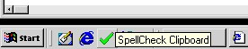



## Clipboard spellcheck/Right\-click File Spellcheck

### Description

This is very cool. For those of you who appreciate it, thanks. For those of you who are just looking for something to put down, move along. I don't want the coding award, so you don't need to try to make me look bad.

WHAT IT DOES:

This code allows you to utilize the Microsoft Word Spellchecker without having to open word. I am constantly typing something on the web (like right now) and I want to do a quick spell check...I have to open word, paste it in, check spelling, copy it, and then paste it back in the browser. This code automates that. Just copy it and run the app. The corrected results will end up in the clipboard ready to paste back in....

ALSO....

If you create a shortcut and place it in your SendTo folder, you can right-click on any text file and check the spelling. The result ends up in the clipboard. A little creativity and you can code a function to save it back in the corrected form. That is a little project for you.

This project is a good example of how to use the Word objects from VB. Enjoy
 
### More Info
 
None (command line parameter or clipboard text)

NOTICE: YOU MUST HAVE MICROSOFT WORD INSTALLED!!!!! THIS WILL NOT WORK IF YOU DON'T!!

Corrected text in clipboard.

             |
---                |---
**Submitted On**   |2001-06-21 18:20:44
**By**             |[Matthew Roberts](https://github.com/Planet-Source-Code/PSCIndex/blob/master/ByAuthor/matthew-roberts.md)
**Level**          |Intermediate
**User Rating**    |5.0 (25 globes from 5 users)
**Compatibility**  |VB 5\.0, VB 6\.0
**Category**       |[OLE/ COM/ DCOM/ Active\-X](https://github.com/Planet-Source-Code/PSCIndex/blob/master/ByCategory/ole-com-dcom-active-x__1-29.md)
**World**          |[Visual Basic](https://github.com/Planet-Source-Code/PSCIndex/blob/master/ByWorld/visual-basic.md)
**Archive File**   |[Right\-clic214766212001\.zip](https://github.com/Planet-Source-Code/matthew-roberts-clipboard-spellcheck-right-click-file-spellcheck__1-24301/archive/master.zip)

